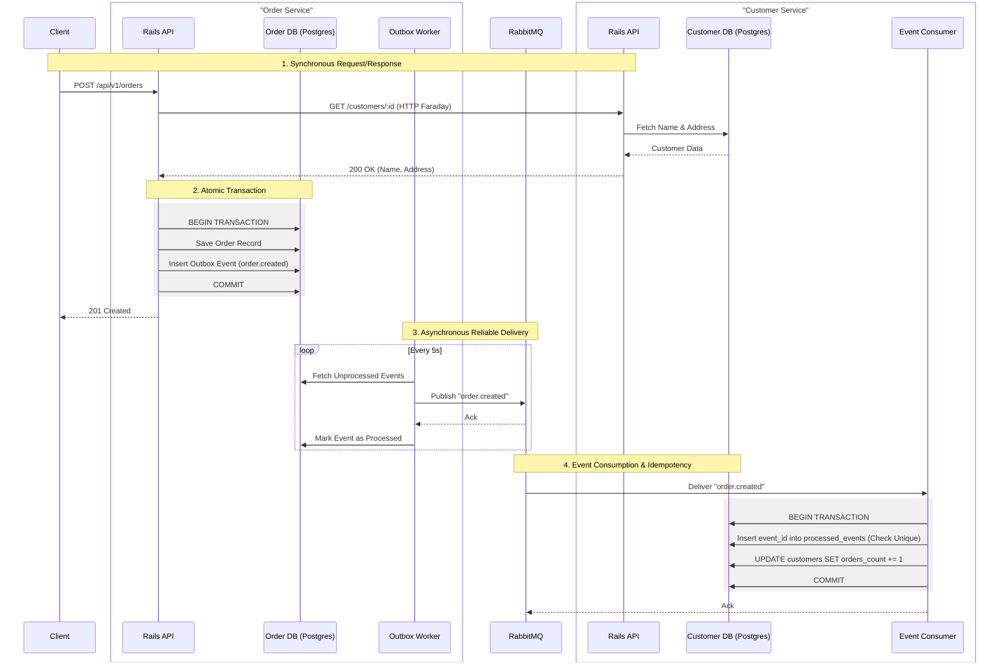

# Backend Challenge

Microservices project: **Order Service** and **Customer Service** (Rails), PostgreSQL, and RabbitMQ.

---

## Overview

| Service                 | Description                           | Port(s)   |
|-------------------------|---------------------------------------|-----------|
| **order_service**       | Orders API                             | 3001      |
| **order_outbox_worker** | Publishes outbox events to RabbitMQ   | —         |
| **customer_service**    | Customers API                         | 3002      |
| **order_created_consumer** | RabbitMQ consumer (order.created) — *start separately* | —   |
| **order_db**            | PostgreSQL (Order Service)            | 5433      |
| **customer_db**         | PostgreSQL (Customer Service)        | 5434      |
| **rabbitmq**            | Message broker + management UI        | 5672, 15672 |

All services use network `be_test_net`. DB config: `POSTGRES_HOST`, `POSTGRES_USER`, `POSTGRES_PASSWORD`, `POSTGRES_DB` (see `docker-compose.yml`).

### Architecture Diagram



**Order → Customer HTTP call:** Before persisting an order, Order Service calls Customer Service via **HTTP GET** (e.g. `GET /customers/:customer_id`) to fetch `customer_name` and `address`. That data is used for validation and can be stored or used in the order flow; the actual order row is written in the same transaction as the outbox event.

---

## Quick Start (Docker)

**Requirements:** Docker and Docker Compose.

```bash
cd backend-challenge
docker compose up --build -d
docker compose ps -a   # wait until healthy (~30–60 s for Rails)
```

**Endpoints**

| App              | URL                        |
|------------------|----------------------------|
| Order Service    | http://localhost:3001      |
| Customer Service | http://localhost:3002      |
| RabbitMQ UI      | http://localhost:15672 (guest / guest) |

### API routes (endpoint documentation)

**Order Service** (base: `http://localhost:3001`)

| Method | Route | Description |
|--------|--------|-------------|
| GET | `/api/v1/orders` | List all orders (newest first). |
| GET | `/api/v1/orders?customer_id=123` | **Consultar pedidos** — list orders for a given customer. |
| GET | `/api/v1/orders/:id` | Show a single order. |
| POST | `/api/v1/orders` | Create order. Body: `customer_id`, `product_name`, `quantity`, optional `price`, `status`. Optional header: `Idempotency-Key` for idempotent creation. |

Before creating an order, Order Service calls Customer Service via **HTTP GET** to resolve the customer (e.g. `GET {CUSTOMER_SERVICE_URL}/customers/:customer_id`) and fetches `customer_name` and `address`; the order is only saved after a successful response (or a well-defined error is returned).

**Customer Service** (base: `http://localhost:3002`)

| Method | Route | Description |
|--------|--------|-------------|
| GET | `/customers/:id` | Get customer by id (name, address, orders_count). Requires `X-Internal-Api-Key` when called by Order Service. |

**Stop:** `docker compose down`

### Starting the RabbitMQ consumer (Customer Service)

For end-to-end flow (orders → outbox → RabbitMQ → customer `orders_count`), the **order.created consumer** must be running. It is not started by `docker compose up`; start it in a separate process.

**Docker (stack already running):**

```bash
docker compose exec customer_service bundle exec rake consumer:order_created
```

This runs the consumer in the foreground (blocking). It subscribes to the `order.created` queue, applies each message via `Orders::ApplyOrderCreated`, and acks only after a successful DB commit (at-least-once with idempotency).

**Local (no Docker):**

From the `customer_service` directory, with DB and RabbitMQ available:

```bash
cd customer_service
bundle exec rake consumer:order_created
```

For production you would typically run this as a long-lived process (e.g. systemd unit or separate container) and scale with multiple consumer instances.

---

## Tests and Linting

Both apps use **RSpec**. Use **`RAILS_ENV=test`** for any test command in Docker.

### Docker (stack must be running)

One-time: create test DBs and migrate:

```bash
docker compose exec order_service bundle exec rails db:create db:migrate RAILS_ENV=test
docker compose exec customer_service bundle exec rails db:create db:migrate RAILS_ENV=test
```

Then run tests or lint (use **`-e RAILS_ENV=test`** with exec so the test environment loads; otherwise the container defaults to development and request specs can get 403):

```bash
# Tests (full suite; includes integration and request specs)
docker compose exec -e RAILS_ENV=test order_service bundle exec rspec
docker compose exec -e RAILS_ENV=test customer_service bundle exec rspec

# Lint (Order Service)
docker compose exec order_service bundle exec rubocop
```

**Customer Service:** `bundle exec rspec` runs the full suite, including the integration test **`spec/integration/order_created_at_least_once_spec.rb`** (at-least-once idempotency: applying the same `event_id` twice increments `orders_count` only once). No extra flags needed.

### Docker (one-off, no stack)

```bash
docker compose run --rm -e RAILS_ENV=test order_service bundle exec rails db:create db:migrate
docker compose run --rm -e RAILS_ENV=test order_service bundle exec rspec
# Same for customer_service
```

### Local (no Docker)

From each service directory (`order_service` or `customer_service`):

```bash
export POSTGRES_HOST=localhost POSTGRES_USER=... POSTGRES_PASSWORD=... POSTGRES_DB=..._development
bundle install
rails db:create db:migrate RAILS_ENV=test
bundle exec rspec
```

Code is mounted in containers; rebuild only when **Gemfile** or **Dockerfile** changes: `docker compose build <service>`.

---

## Architecture

### Transactional Outbox (Order Service)

**Why the Outbox pattern?**  
We use it to avoid the **dual-write problem**. Writing the order to the DB and then publishing to RabbitMQ in two steps can leave the system inconsistent (e.g. order saved but publish fails, or the reverse). The Outbox pattern gives one source of truth: the order and an outbox row are written in **one database transaction**. A worker later publishes from the outbox to RabbitMQ. If the broker is down, events stay in the outbox and can be retried without losing or duplicating business state.

**How it works**

- **`Orders::CreateOrder`** first calls **Customer Service via HTTP** (GET `/customers/:id`) to fetch `customer_name` and `address`; if the customer is missing or the service is unavailable, it returns an error without writing the order. On success, it creates the order and an `OutboxEvent` in a single `ActiveRecord` transaction.
- Events live in the **`outbox_events`** table. **`Outbox::PublishingWorker`** claims rows with `FOR UPDATE SKIP LOCKED` (safe for multiple worker containers), publishes to RabbitMQ (`exchange: orders.v1`, `routing_key: order.created`) with exponential backoff, and marks them processed only after a successful publish.
- **Docker:** `order_outbox_worker` waits for `order_db` and `rabbitmq` to be healthy, then runs the publish loop (e.g. every 5s).
- **Rake:** `bundle exec rake outbox:publish_once` or `bundle exec rake "outbox:publish[5]"`.

API responses use a **Result object** (`Result::Success` / `Result::Failure`).

### Idempotency (Customer Service)

If RabbitMQ delivers the same `order.created` message twice, **`orders_count` must not be incremented twice**.

- Each message carries a unique **`event_id`** (outbox row id).
- **Customer Service** has a **`processed_order_events`** table with a unique constraint on `event_id`.
- **`Orders::ApplyOrderCreated`** skips if `event_id` is already present; otherwise it records the event and increments `orders_count`. Concurrent duplicates are handled via `RecordNotUnique`.

So **`orders_count` is incremented at most once per event**, even with duplicate deliveries.

---

## Quick Reference

| Task              | Command |
|-------------------|---------|
| Start stack      | `docker compose up --build -d` |
| Start RabbitMQ consumer (Customer Service) | `docker compose exec customer_service bundle exec rake consumer:order_created` |
| Order Service tests | `docker compose exec -e RAILS_ENV=test order_service bundle exec rspec` |
| Customer Service tests | `docker compose exec -e RAILS_ENV=test customer_service bundle exec rspec` (includes integration test) |
| Lint Order Service | `docker compose exec order_service bundle exec rubocop` |
